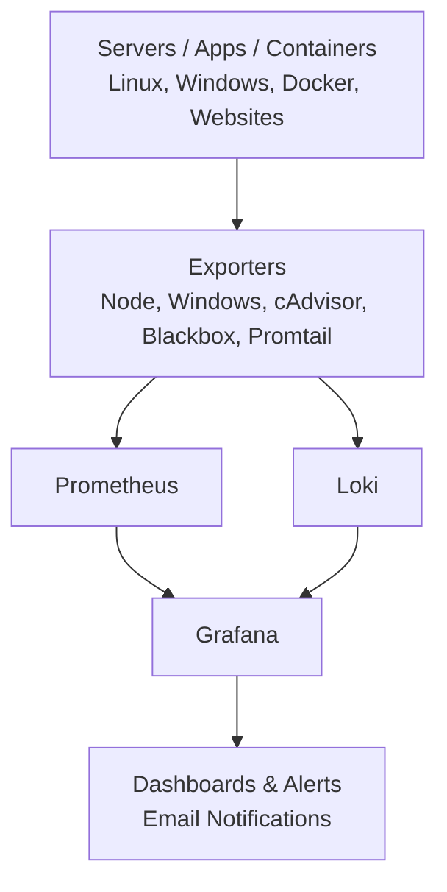

**📊 Grafana Monitoring, Logging & Alerting Stack
**
🚀 Project Overview

This project demonstrates a complete, production-grade monitoring, logging, and alerting stack built using modern observability tools:

Prometheus

Grafana

Loki

Promtail

Blackbox Exporter

Node Exporter

Windows Exporter

cAdvisor

🔍 It monitors:

Linux servers

Windows servers

Docker containers

Websites / APIs

Centralized logs

⚡ It also supports:

Email alerts

Uptime monitoring

Resource monitoring

---

## 🏗️ Architecture



## 🧰 Tech Stack

- **Monitoring:** Prometheus, Grafana  
- **Logging:** Loki, Promtail  
- **Exporters:** Node Exporter, Windows Exporter, cAdvisor, Blackbox Exporter  
- **Containerization:** Docker & Docker Compose  

---

## 📈 Features

- Linux server monitoring (CPU, RAM, Disk, Network)  

- Windows server monitoring  

- Docker container monitoring  

- Website uptime, latency, and SSL monitoring  

- Centralized log monitoring using Loki  

- Email alerting for:
  - High CPU usage  
  - Website down  
  - Docker container down  

---

## 📂 Project Structure

Grafana-Monitoring-Stack/
├── docker-compose.yml
├── prometheus.yml
├── Linux_Servers.yml
├── Windows_servers.yml
├── alertmanager.yml
├── rules.yml
├── blackbox/
├── loki/
├── promtail/
├── templates/
├── grafana-data/
├── loki-data/
├── screenshots/
└── README.md


---

## ▶️ How to Run

Start the stack using Docker Compose:

```bash
docker compose up -d
Open in your browser:

Grafana: http://monitor.deployflow.tech/

Prometheus: http://192.168.0.190:9090

📸 Dashboards
Screenshots are available in the screenshots/ folder:

Linux server monitoring dashboard

Windows server monitoring dashboard

Docker containers monitoring dashboard

Website monitoring dashboard (Blackbox)

Loki logs dashboard

🚨 Alerts Implemented
CPU usage > 80%

Website down

Docker container down

Alerts are sent using Grafana Email Alerting.

🧪 Tested Environment
Ubuntu / Debian Linux

Docker & Docker Compose

Windows Server with windows_exporter

👨‍💻 Author
Rashmik Parmar
DevOps Engineer
